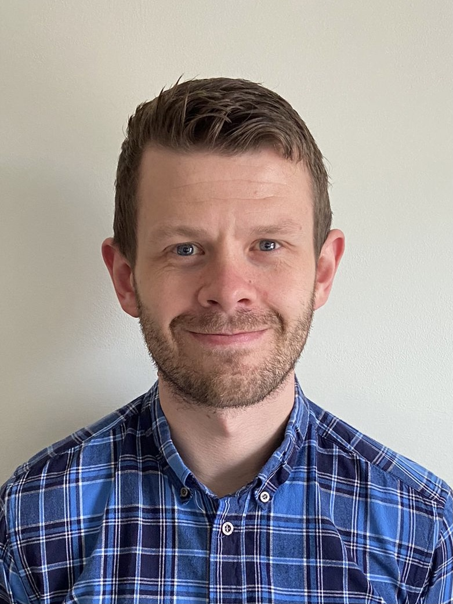

Aside
================================================================================

{width=100%}

Contact Info {#contact}
--------------------------------------------------------------------------------

- <i class="fa fa-envelope"></i> chris@indigoneuro.co.uk
- For more information, please contact me via email.

Skills {#skills}
--------------------------------------------------------------------------------

- Experienced in applications of clinical psychology and clinical neuropsychology for a variety of populations.

- Highly experienced in working with people who experience a variety of cognitive, behavioural or emotional difficulties.

- Specialist experience in working with functional neurological symptoms.

- Experience in working across the lifespan; particularly in young adults, pediatrics, families and working age adults.

Disclaimer {#disclaimer}
--------------------------------------------------------------------------------

Main
================================================================================

Dr. Chris Gaskell {#title}
--------------------------------------------------------------------------------

### Senior Clinical Psychologist & Honorary Researcher

Education {data-icon=graduation-cap data-concise=true}
--------------------------------------------------------------------------------

### University of Chester

BSc in Psychology (First-Class Honours)

Chester, UK

2010-13

Thesis: Demystifying the complexity of psychological flexibility.

### University of Sheffield

DClinPsy in Clinical Psychology

Sheffield, UK

2018-21

Thesis: The effectiveness of psychological interventions in routine settings (no corrections)

Clinical Experience {data-icon=suitcase}
--------------------------------------------------------------------------------

### Senior Clinical Psychologist

North Staff Combined NHS Foundation Trust

Stoke-on-Trent, UK

2022 - Present

- Senior clinical psychologist working with neurological presentations (including functional neurological).

### Psychologist Associate

IndigoNeuro

North-West, UK

2020 - Present

-	Carrying out assessment and intervention with children and young people who have experienced brain injuries.
-	Working at a family and systems levels of intervention.
- Providing clinical leadership to the multi disciplinary team.
-	Preparing and developing training on neuropsychological aspects of brain injury for schools.

### Clinical Psychologist

Salford Royal NHS Foundation Trust

Manchester, UK

2020 - 2022

- Experience as a clinical psychologist treating individuals who experience a variety of functional neurological presentations.
  

Research Experience {data-icon=laptop}
--------------------------------------------------------------------------------

### Honorary Researcher 

University of Sheffield

Sheffield, UK

2018 - Present

- Regularly publish peer-reviewed journals articles across a variety of clinical topics, including: the effectiveness of psychological interventions, advanced quantitative methods, and psychological mechanisms of neurological conditions.
- Specialist expertise in practice-based methodologies including single case experimental design, meta-analysis and longitudinal multilevel models.
- Provide research supervision to DClinPsy and MSc students.

Teaching Experience {data-icon=chalkboard-teacher}
--------------------------------------------------------------------------------

### Workshop leader on single case experimental design methodology.

Teaching designer and facilitator for clinical psychology doctoral trainees & clinical associate psychologists.

Sheffield, UK

2020 - present

### Visiting lecturer on working with functional neurological disorders.

Introductory workshop for trainee paramedics concerning functional neurological disorders and non-epileptic attacks.

Edgehill University, UK

2021 - 2022

Selected Publications {data-icon=file}
--------------------------------------------------------------------------------

### A meta-analytic review of the effectiveness of psychological treatment of functional / dissociative seizures on non-seizure outcomes in adults

Epilepsia. 2023;(in press).

N/A

2023

**Gaskell, C**, et al.,

### Long-term psychotherapy in tertiary care: A practice-based benchmarking study

British Journal of Clinical Psychology. 2023;(in press).

N/A

2023

**Gaskell, C**, et al.,

### The effectiveness of psychological interventions delivered in routine practice. Systematic review and meta-analysis

Administration and Policy in Mental Health and Mental Health Services Research. 2022.

N/A

2022

**Gaskell, C**, et al.,

