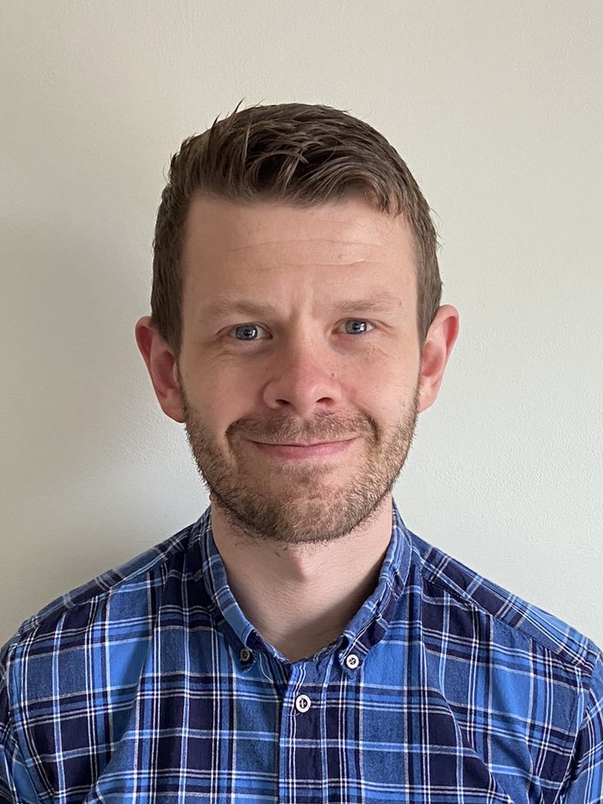

Aside
================================================================================

{width=100%}

Contact Info {#contact}
--------------------------------------------------------------------------------

- <i class="fa fa-envelope"></i> chris@indigoneuro.co.uk
- <i class="fa fa-phone"></i> 07883910093
- For more information, please contact me via email.

Skills {#skills}
--------------------------------------------------------------------------------

- Experienced in applications of clinical psychology and clinical neuropsychology for a variety of populations.

- Highly experienced in working with people who experience a variety of cognitive, behavioural or emotional difficulties.

- Specialist experience in working with functional neurological symptoms.

- Experience in working across the lifespan; particularly in young adults, pediatrics, families and working age adults.

Disclaimer {#disclaimer}
--------------------------------------------------------------------------------

Main
================================================================================

{width=40%}

Dr. Chris Gaskell {#title}
--------------------------------------------------------------------------------

### Clinical Psychologist & Honorary Researcher

Education {data-icon=graduation-cap data-concise=true}
--------------------------------------------------------------------------------

### University of Chester

BSc in Psychology

Chester, UK

2010-13

Thesis: Demystifying the complexity of psychological flexibility.

### University of Sheffield

DClinPsy In Clinical Psychology

Sheffield, UK

2018-21

Thesis: The effectiveness of psychological interventions in routine settings

Clinical Experience {data-icon=suitcase}
--------------------------------------------------------------------------------

### Clinical Psychologist

Salford Royal NHS foundation trust

Manchester, UK

2020 - Present

- Specialist experience as a trainee critical psychologist, and more recently qualified clinical psychologist in treating individuals who experience functional neurological presentations.

### Psychologist Associate

Indigo Neuro

North-West, UK

2020 - Present

-	Carrying out assessment and intervention with children and young people who have experienced brain injuries.
-	Working at a family and systems levels of intervention.
- Providing clinical leadership to the multi disciplinary team.
-	Preparing and developing training on neuropsychological aspects of brain injury for schools.
  

Research Experience {data-icon=laptop}
--------------------------------------------------------------------------------

### Honorary Researcher 

University of Sheffield

Sheffield, UK

2018 - Present

- Regular publisher of peer-reviewed journals concerning the effectiveness of psychological therapy in routine settings.
- Specialist expertise in practice-based methodologies including single case experimental design, meta-analysis and longitudinal multilevel modeling.

Teaching Experience {data-icon=chalkboard-teacher}
--------------------------------------------------------------------------------

### Workshop leader on single case experimental design methodology.

Teaching designer and facilitator for clinical psychology doctoral trainees & clinical associate psychologists.

Sheffield, UK

2020 - present

### Visiting lecturer on working with functional neurological disorders.

Introductory workshop for trainee paramedics concerning functional neurological disorders and non-epileptic attacks.

Edgehill University, UK

2021 - Present

Selected Publications {data-icon=file}
--------------------------------------------------------------------------------

### Effectiveness of the unified protocol for treating co-morbid health anxiety and depression: an empirical case study

Behavioural and Cognitive Psychotherapy. 2021;(in press).

N/A

2021

**Gaskell, C**, Hague, B, Kellett, S.

### Effectiveness of transdiagnostic seminars to support patients with common mental disorders: a multi-service practice research network study

Behavioural and Cognitive Psychotherapy. 2021;49(4), 495-507.

N/A

2021

**Gaskell, C**, Askey-Jones, R, Groom, M. Delgadillo, J.

